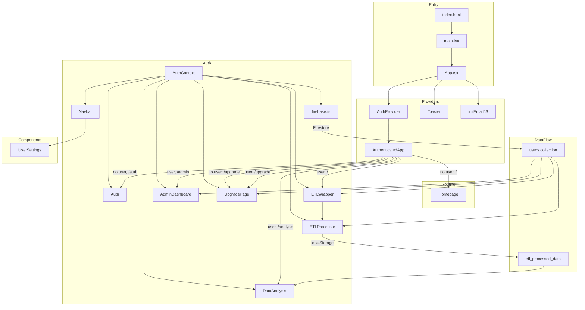

# AnalytixFlow – Project Flow & Algorithms

## 1. Project Flow Chart (File Interconnections)

```
┌─────────────────────────────────────────────────────────────────────────────────────────┐
│                                    ENTRY POINT                                           │
├─────────────────────────────────────────────────────────────────────────────────────────┤
│  index.html → main.tsx → App.tsx                                                         │
│                    │                                                                     │
│                    ├── Toaster (react-hot-toast)                                         │
│                    ├── initEmailJS() [lib/emailjs.ts]                                    │
│                    └── AuthProvider [contexts/AuthContext.tsx]                           │
│                              │                                                           │
│                              └── AuthenticatedApp                                        │
└─────────────────────────────────────────────────────────────────────────────────────────┘

┌─────────────────────────────────────────────────────────────────────────────────────────┐
│                              AuthContext (Central Auth Hub)                              │
├─────────────────────────────────────────────────────────────────────────────────────────┤
│  contexts/AuthContext.tsx                                                                │
│       │                                                                                  │
│       ├── Uses: lib/firebase.ts (auth, db, ADMIN_EMAIL)                                  │
│       ├── Exports: useAuth() → { user, login, signup, logout, canUpload, ... }          │
│       └── Consumed by: Auth, Navbar, ETLWrapper, ETLProcessor, DataAnalysis,            │
│                        AdminDashboard, UpgradePage, UserSettings                         │
└─────────────────────────────────────────────────────────────────────────────────────────┘

┌─────────────────────────────────────────────────────────────────────────────────────────┐
│                              ROUTING (path-based)                                        │
├─────────────────────────────────────────────────────────────────────────────────────────┤
│                                                                                          │
│  NOT LOGGED IN:                                                                          │
│  ┌─────────────┐     /auth      ┌─────────────┐     /upgrade     ┌─────────────┐        │
│  │  Homepage   │ ────────────►  │    Auth     │ ◄────────────── │ UpgradePage │        │
│  │ (landing)   │                │ (login/signup)│                │ (payment)    │        │
│  └─────────────┘                └─────────────┘                 └─────────────┘        │
│         │                              │                                │                │
│         │                              │                                │                │
│         └──────────────────────────────┴────────────────────────────────┘                │
│                                    │                                                     │
│                                    ▼                                                     │
│  LOGGED IN:                                                                              │
│  ┌─────────────┐                                                                         │
│  │   Navbar    │  (always visible)                                                      │
│  └──────┬──────┘                                                                         │
│         │                                                                                 │
│         ├── / (default)     ──►  ETLWrapper ──►  ETLProcessor                            │
│         ├── /analysis      ──►  DataAnalysis                                            │
│         ├── /admin         ──►  AdminDashboard  (if user.isAdmin)                       │
│         └── /upgrade       ──►  UpgradePage                                              │
│                                                                                          │
└─────────────────────────────────────────────────────────────────────────────────────────┘

┌─────────────────────────────────────────────────────────────────────────────────────────┐
│                              DATA FLOW                                                   │
├─────────────────────────────────────────────────────────────────────────────────────────┤
│                                                                                          │
│  ETLProcessor                          DataAnalysis                                      │
│       │                                      │                                            │
│       │  localStorage.setItem(                │  localStorage.getItem(                     │
│       │    'etl_processed_data',             │    'etl_processed_data'                   │
│       │    JSON.stringify(data)              │  )                                         │
│       │  )                                   │       │                                    │
│       │                                      │       ▼                                    │
│       └──────────────────────────────────────┴──► Parsed JSON → charts, insights, AI     │
│                                                                                          │
│  Firebase Firestore (lib/firebase.ts):                                                   │
│  • users/{uid} → plan, uploadCount, email, displayName, lastUpgradeDate                  │
│  • Used by: AuthContext, ETLWrapper, ETLProcessor, AdminDashboard, UpgradePage          │
│                                                                                          │
└─────────────────────────────────────────────────────────────────────────────────────────┘

┌─────────────────────────────────────────────────────────────────────────────────────────┐
│                              LIBRARY / SERVICE DEPENDENCIES                              │
├─────────────────────────────────────────────────────────────────────────────────────────┤
│                                                                                          │
│  lib/firebase.ts                                                                         │
│  ├── Used by: AuthContext, ETLWrapper, ETLProcessor, AdminDashboard, UpgradePage         │
│  ├── Exports: auth, db, storage, ADMIN_EMAIL, canUserUpload, incrementUploadCount,      │
│  │            getUserUploadCount, upgradeUserToPremium, downgradeUserToFree,             │
│  │            initializeUserData                                                        │
│  └── Env: VITE_FIREBASE_*                                                               │
│                                                                                          │
│  lib/emailjs.ts                                                                          │
│  ├── Used by: App.tsx (init), ContactForm, UpgradeRequestForm, etc.                     │
│  └── Exports: initEmailJS, sendEmail, sendContactEmail                                   │
│                                                                                          │
│  ETLProcessor uses:                                                                      │
│  ├── react-dropzone, Papa (papaparse), XLSX, lodash                                      │
│  └── firebase (canUserUpload, incrementUploadCount, getUserUploadCount)                   │
│                                                                                          │
│  DataAnalysis uses:                                                                      │
│  ├── Chart.js, react-chartjs-2, Papa, XLSX                                              │
│  ├── useAuth (AuthContext)                                                               │
│  └── Optional: Groq API (VITE_GROQ_API_KEY) for "Ask AI" fallback                        │
│                                                                                          │
└─────────────────────────────────────────────────────────────────────────────────────────┘
```

---

## 2. Mermaid Diagram (Flowchart)



---

## 3. Methodologies & Algorithms Used

### 3.1 ETL (Extract, Transform, Load)

| Step | Methodology | Implementation |
|------|-------------|----------------|
| **Extract** | File parsing, API fetch | Papa (CSV), XLSX (Excel), `fetch()` for API URL |
| **Transform** | Rule-based transformations | 15+ ops: uppercase, lowercase, trim, replace, fillNull, formatDate, roundNumber, extractNumbers, extractEmails, etc. |
| **Load** | Client-side storage | `localStorage` + Firestore (user metadata, upload count) |

### 3.2 Statistics (ETLProcessor & DataAnalysis)

| Metric | Algorithm | Formula / Logic |
|--------|------------|-----------------|
| **Mean** | Arithmetic mean | \(\bar{x} = \frac{1}{n}\sum_{i=1}^{n} x_i\) |
| **Median** | Sorted middle value | `_.sortBy(values)[Math.floor(length/2)]` |
| **Min / Max** | Direct comparison | `_.min(values)`, `_.max(values)` |
| **Null count** | Filter empty | `row[col] === null \|\| undefined \|\| ""` |

### 3.3 Predictions (DataAnalysis)

| Algorithm | Description |
|-----------|-------------|
| **Simple linear regression** | Fits \(y = mx + c\) where \(x\) = row index, \(y\) = column value. Uses least-squares: slope \(m = \frac{n\sum xy - \sum x \sum y}{n\sum x^2 - (\sum x)^2}\), intercept \(c = \bar{y} - m\bar{x}\). Extrapolates next 5 points. |

### 3.4 Correlations (DataAnalysis)

| Algorithm | Description |
|-----------|-------------|
| **Pearson correlation** | \(r = \frac{n\sum xy - \sum x \sum y}{\sqrt{(n\sum x^2 - (\sum x)^2)(n\sum y^2 - (\sum y)^2)}}\). Pairs with \|r\| > 0.5 shown. |

### 3.5 Anomaly Detection (DataAnalysis)

| Algorithm | Description |
|-----------|-------------|
| **Z-score (2σ rule)** | Values where \(\|x - \mu\| > 2\sigma\) flagged as outliers. \(\mu\) = mean, \(\sigma\) = standard deviation. |

### 3.6 Data Quality (DataAnalysis)

| Check | Logic |
|-------|-------|
| **Missing values** | % of null/empty per column; warn if > 10% |
| **Duplicates** | `Set(JSON.stringify(row))` vs row count |
| **Numeric detection** | > 50% of values parse as numbers → numeric column |

### 3.7 "Ask AI" Logic (DataAnalysis)

| Layer | Method |
|-------|--------|
| **Local (keyword + stats)** | Matches "average", "mean", "how many rows", "how many columns", "which columns", "list columns". Uses column-name matching for averages. |
| **Online fallback** | Groq API (Llama) when local logic can't answer. Requires `VITE_GROQ_API_KEY` and backend proxy for CORS. |

### 3.8 Column Suggestions (DataAnalysis)

| Type | Heuristic |
|------|-----------|
| **Date columns** | Column name matches `/date|time|timestamp/i` → suggest `day_of_week`, `month` |
| **Numeric columns** | Ratio column, z-score column |
| **Fallback** | `record_id`, `group_label` |

### 3.9 Chart Recommendations (DataAnalysis)

| Rule | Output |
|------|--------|
| Numeric columns exist | line, bar |
| Numeric + categorical | grouped-bar, stacked-bar |
| Time-related columns | time-series |
| Categorical columns | pie, donut |

### 3.10 Auth & Plan Logic (firebase.ts, AuthContext)

| Rule | Logic |
|------|-------|
| **Admin** | `email === ADMIN_EMAIL` → `plan: "premium"`, `isAdmin: true` |
| **Free upload limit** | `plan === "free"` and `uploadCount >= 1` → block upload |
| **Premium** | Unlimited uploads |

---

## 4. File Dependency Summary

| File | Imports / Depends On |
|------|----------------------|
| `main.tsx` | App, index.css |
| `App.tsx` | AuthProvider, Navbar, ETLWrapper, DataAnalysis, Homepage, Auth, AdminDashboard, UpgradePage, useAuth, initEmailJS |
| `AuthContext.tsx` | firebase (auth, db, ADMIN_EMAIL) |
| `firebase.ts` | Firebase SDK, env vars |
| `ETLWrapper.tsx` | AuthContext, ETLProcessor, firebase (db) |
| `ETLProcessor.tsx` | AuthContext, firebase (canUserUpload, incrementUploadCount, getUserUploadCount), Papa, XLSX, lodash, react-dropzone |
| `DataAnalysis.tsx` | AuthContext, Chart.js, react-chartjs-2, Papa, XLSX, Groq (optional) |
| `Navbar.tsx` | AuthContext, UserSettings |
| `Auth.tsx` | AuthContext |
| `AdminDashboard.tsx` | AuthContext, firebase (upgradeUserToPremium, downgradeUserToFree), Firestore |
| `UpgradePage.tsx` | AuthContext, firebase (db), Razorpay |
| `Homepage.tsx` | (standalone, no auth deps) |
| `emailjs.ts` | @emailjs/browser |

---

## 5. Environment Variables

| Variable | Used By | Purpose |
|----------|---------|---------|
| `VITE_FIREBASE_API_KEY` | firebase.ts | Firebase config |
| `VITE_FIREBASE_AUTH_DOMAIN` | firebase.ts | Firebase config |
| `VITE_FIREBASE_PROJECT_ID` | firebase.ts | Firebase config |
| `VITE_FIREBASE_STORAGE_BUCKET` | firebase.ts | Firebase config |
| `VITE_FIREBASE_MESSAGING_SENDER_ID` | firebase.ts | Firebase config |
| `VITE_FIREBASE_APP_ID` | firebase.ts | Firebase config |
| `VITE_FIREBASE_MEASUREMENT_ID` | firebase.ts | Firebase config |
| `VITE_GROQ_API_KEY` | DataAnalysis.tsx | Optional Groq API for "Ask AI" fallback |
